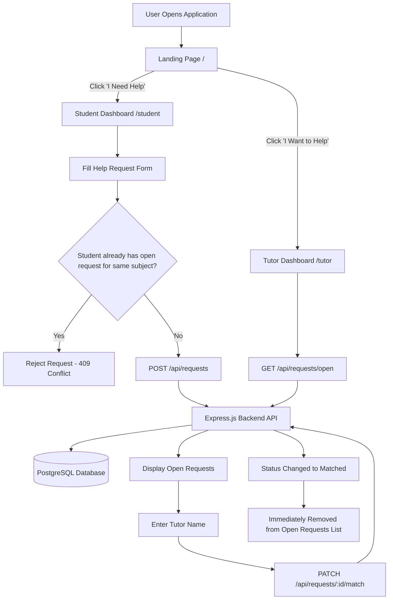

# Peer Tutoring Matchmaker

A full-stack web application designed to connect students needing academic assistance with peer tutors. Built using **Node.js**, **Express.js**, **PostgreSQL**, **React (Vite)**, **React Router**, and **Axios**.

---

## 📌 Project Overview

The **Peer Tutoring Matchmaker** application facilitates peer-to-peer academic support through a multi-page workflow driven by React Router. It allows students to request help for specific subjects and topics, while providing peer tutors with a dedicated dashboard to view, accept, and match open help requests.

---

## 🛠️ Tech Stack

### **Backend**
* **Runtime & Framework**: Node.js & Express.js (v5)
* **Database**: PostgreSQL (connected via `pg` Pool driver)
* **Environment & Security**: `dotenv` for configuration, `cors` for Cross-Origin Resource Sharing
* **Development Tools**: `nodemon` for live server reloading

### **Frontend**
* **Library & Build Tool**: React 19 & Vite
* **Routing**: React Router (`react-router-dom` v7)
* **HTTP Client**: Axios
* **Styling**: Clean custom CSS (900px centered CRUD assessment layout, rectangular inputs, custom buttons, no heavy frameworks)

---

## ✨ Features & Core Business Rules

* **Landing Page (`/`)**: Features two primary action cards:
  * 📚 **I Need Help**: Navigates to the Student Dashboard.
  * 👨‍🏫 **I Want to Help**: Navigates to the Tutor Dashboard.
* **Student Dashboard (`/student`)**:
  * Form submission with fields for **Student Name**, **Subject**, and **Topic**.
  * **Duplicate Student Request Protection**: Enforces Rubric Logic Rule 1 (`LOWER(student_name) = LOWER($1) AND LOWER(subject) = LOWER($2) AND status = 'Open'`). If a student already has an active 'Open' request for that exact same subject, the backend rejects it with `409 Conflict`.
  * Interactive success notification with a direct link back to Home.
* **Tutor Dashboard (`/tutor`)**:
  * Displays open help requests (`WHERE status = 'Open'`).
  * Inline tutor name input with an **Accept Request** action button.
  * **Automated Removal (Rubric Logic Rule 2)**: Once accepted, status updates to `Matched` in PostgreSQL and immediately disappears from the Open Requests API view (`/api/requests/open`).
* **Robust Error Handling**: Handles missing fields (`400`), invalid non-numeric IDs (`400`), non-existent records (`404`), and already-matched requests (`409`).

---

## 🏗️ Architecture Diagram

### **System Architecture Flow**



### **Component Connection Flow**

```text
+-----------------------------------------------------------------------+
|                           REACT FRONTEND                              |
|                                                                       |
|  Landing Page ( / ) ----> Student Dashboard ( /student )              |
|        |                          |                                   |
|        |                          v                                   |
|        |                  RequestForm Component                       |
|        |                          |                                   |
|        v                          v (POST /api/requests)              |
|  Tutor Dashboard ( /tutor ) -----> Axios API Client                   |
|        |                               |                              |
|        v                               v                              |
|  RequestList Component -------------> CORS Middleware                 |
|  (GET /api/requests/open)              |                              |
|  (PATCH /api/requests/:id/match)       v                              |
+----------------------------------------|------------------------------+
                                         | HTTP / JSON
                                         v
+-----------------------------------------------------------------------+
|                           EXPRESS BACKEND                             |
|                                                                       |
|                       server.js (Express Server)                      |
|                                   |                                   |
|                       routes/requestRoutes.js                         |
|                                   |                                   |
|                    controllers/requestController.js                   |
|                                   |                                   |
|                         config/db.js (pg Pool)                        |
|                                   |                                   |
+-----------------------------------|-----------------------------------+
                                    | SQL Queries
                                    v
+-----------------------------------------------------------------------+
|                          POSTGRESQL DATABASE                          |
|                                                                       |
|                      Database: peer_tutoring_db                       |
|                        Table: help_requests                           |
|                                                                       |
+-----------------------------------------------------------------------+
```

---

## 📂 Folder Structure

```text
peer_tutor/
│
├── backend/                  # Node.js + Express REST API
│   ├── config/
│   │   └── db.js             # PostgreSQL connection pool setup
│   ├── controllers/
│   │   └── requestController.js # Request controller (create, getOpen, matchTutor)
│   ├── routes/
│   │   └── requestRoutes.js  # API route definitions
│   ├── .env                  # Environment variables (DB credentials & Port)
│   ├── package.json          # Backend dependencies & npm scripts
│   └── server.js             # Express app entrypoint & server bootstrap
│
├── frontend/                 # React Single Page Application (Vite)
│   ├── public/               # Static web assets
│   ├── src/
│   │   ├── components/
│   │   │   ├── Navbar.jsx    # Header with title & "Back to Home" navigation
│   │   │   ├── RequestForm.jsx # Help request creation form
│   │   │   ├── RequestList.jsx # Available open help requests list
│   │   │   ├── RequestCard.jsx # Card component displaying request details & status
│   │   │   └── MatchTutor.jsx  # Inline tutor input & "Accept Request" action
│   │   ├── pages/
│   │   │   ├── LandingPage.jsx      # Home landing page ( / )
│   │   │   ├── StudentDashboard.jsx # Student portal ( /student )
│   │   │   └── TutorDashboard.jsx   # Tutor portal ( /tutor )
│   │   ├── services/
│   │   │   └── api.js        # Centralized Axios service instance
│   │   ├── styles/
│   │   │   └── styles.css    # Custom CSS stylesheet
│   │   ├── App.jsx           # React Router configuration
│   │   └── main.jsx          # React DOM mounting entrypoint
│   ├── package.json          # Frontend dependencies & npm scripts
│   └── vite.config.js        # Vite configuration
│
├── .gitignore                # Git exclusion rules
├── User Request Management Flow-2026-07-28-131900.pdf # Architectural Flowchart Diagram
├── FRONTEND.txt              # Frontend documentation & full source code
└── README.md                 # Project documentation
```

---

## 🗄️ Database Setup (PostgreSQL)

Run the following SQL commands in your PostgreSQL CLI (`psql`) or pgAdmin to create the database and table:

```sql
-- 1. Create Database
CREATE DATABASE peer_tutoring_db;

-- Connect to database
\c peer_tutoring_db;

-- 2. Create help_requests Table
CREATE TABLE help_requests (
    id SERIAL PRIMARY KEY,
    student_name VARCHAR(255) NOT NULL,
    subject VARCHAR(255) NOT NULL,
    topic TEXT NOT NULL,
    status VARCHAR(50) DEFAULT 'Open',
    tutor_name VARCHAR(255),
    created_at TIMESTAMP DEFAULT CURRENT_TIMESTAMP,
    updated_at TIMESTAMP DEFAULT CURRENT_TIMESTAMP
);
```

---

## 🔌 API Endpoints

Base URL: `http://localhost:5000/api`

| Method | Endpoint | Description | Request Body / Params | Expected Response |
| :--- | :--- | :--- | :--- | :--- |
| `GET` | `/` | Server Health Check | None | `200 OK` — Plain text status |
| `POST` | `/api/requests` | Create a new help request | Body: `{ "student_name": "Alice", "subject": "Math", "topic": "Calculus" }` | `201 Created` — Created request object<br>`409 Conflict` — If student has open request for subject |
| `GET` | `/api/requests` | Fetch all requests | None | `200 OK` — `{ count: N, data: [...] }` |
| `GET` | `/api/requests/open` | Fetch requests with `status = 'Open'` | None | `200 OK` — `{ count: N, data: [...] }` |
| `PATCH` | `/api/requests/:id/match` | Accept/match a tutor to a request | Params: `:id`<br>Body: `{ "tutor_name": "Bob" }` | `200 OK` — Updated request object |

---

## 🚀 Installation & Running Guide

### **1. General Installation**
Clone the repository to your local machine:
```bash
git clone https://github.com/YOUR_USERNAME/peer_tutor.git
cd peer_tutor
```

---

### **2. Backend Setup**
1. Navigate to the `backend/` directory:
   ```bash
   cd backend
   ```
2. Install dependencies:
   ```bash
   npm install
   ```
3. Configure your `.env` file in `backend/.env`:
   ```env
   PORT=5000
   DB_HOST=localhost
   DB_PORT=5432
   DB_USER=postgres
   DB_PASSWORD=your_postgres_password
   DB_NAME=peer_tutoring_db
   ```
4. Start the backend server:
   ```bash
   # Development mode
   npm run dev

   # Production mode
   npm start
   ```
   * Server runs on **`http://localhost:5000`**.

---

### **3. Frontend Setup**
1. Open a new terminal and navigate to the `frontend/` directory:
   ```bash
   cd frontend
   ```
2. Install dependencies:
   ```bash
   npm install
   ```
3. Start the Vite development server:
   ```bash
   npm run dev
   ```
   * Application runs on **`http://localhost:5173`**.
